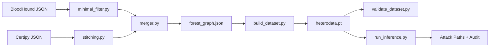

# GNN-AD-Navigator

> Graph Neural Network for Active Directory Attack Path discovery.
> Trained on One Environment, Deploy on any unseen Active Directory graph.


```
╔═══════════════════════════════════════════════════════════════════════════════════════╗
║   ███▄    █  ▄▄▄     ██▒   █▓ ██▓  ▄████   ▄▄▄     ▄▄▄█████▒ ▒█████   ██▀███          ║
║   ██ ▀█   █ ▒████▄  ▓██░   █▒▓██▒ ██▒ ▀█▒▒████▄   ▓  ██▒ ▓▒ ▒██▒  ██▒▓██ ▒ ██▒        ║
║   ██  ▀█ ██▒▒██  ▀█▄ ▓██  █▒░▒██▒▒██░▄▄▄░▒██  ▀█▄ ▒ ▓██░ ▒░ ▒██░  ██▒▓██ ░▄█ ▒        ║
║   ██▒  ▐▌██▒░██▄▄▄▄██ ▒██ █░░░██░░▓█  ██▓░██▄▄▄▄██░ ▓██▓ ░  ▒██   ██░▒██▀▀█▄          ║
║   ██░   ▓██░ ▓█   ▓██▒ ▒▀█░  ░██░░▒▓███▀▒ ▓█   ▓██▒ ▒██▒ ░  ░ ████▓▒░░██▓ ▒██▒        ║
║   ░     ▒░   ▒▒   ▓▒█░  ░ ░   ░░   ░▒   ▒ ▒▒   ▓▒█░ ▒ ░       ▒░▒░▒░ ░ ▒▓ ░▒▓░        ║
║                                                                                       ║
║                                GNN-AD-NAVIGATOR v1.0                                  ║
║                       Active Directory Attack Path Discovery                          ║
╚═══════════════════════════════════════════════════════════════════════════════════════╝
```

## 2. Project Overview & Core Concept

Given a bloodhound.py scan of any active directory environment the trained policy head allows for attack path discovery, important for time sensible engagements reducing graph analysis time while recommending a stealthy, damage aware and best (not necessarily the shortest!) attack path without hand-crafted rules or per-environment retraining.

The trained policy head discovers attack paths between two specified nodes, the suggested path is biased towards the prefrable least impactfull node edges during an engagement thanks to the feature engineering phase.

Unlike the traditional bloodhound neo4j queries that depend heavily on user expertise to formulate the cypher, this tool suggests likely paths and annotates each step with the exploitation technique. It then tries to audits its own output to flag unreliable suggestions.

Trained on a single lab (GOAD with 351 node), the model generalises to a entreprise network (INLANEFREIGHT's 4000 nodes) identifying the documented attack path.

## 3. Architecture
    
- **input :** specify the input directory with raw bloodhound & Certipy scans.
- **Multi-Domain & Identity Aware:** Supports multi-domain forest merging, cross-domain trust traversal, and Active Directory Certificate Services ADCS ingestion via Certipy.
- **Architectural Flexibility:** Gives the option between a simple GCN model, and the better fit HGT model
- **Auditing:** A static rule based logic to notify the end user if his attention is needed.
- **Actions:** For the discovered path, each edge corresponds to an attack vector, the tool can actively suggest the exploitation technique and tool for the job.

## 4. System Requirements

- **OS:** Tested and optimized on Ubuntu 24.04.
- **Python:** Version 3.10+. 
- **Hardware:** 1 GB disk space for CPU execution, 3 GB for CUDA setups (due to PyTorch overhead if retraining). Runs comfortably on 8 GB RAM (inference mode).

## 5. Installation & Setup

both script environmental install and docker setup are available, tho the recommended is the later.


```Bash
# Clone the repository
git clone https://github.com/NizarSenbati/gnn-ad-navigator.git
cd gnn-ad-navigator

# Option A: Quick Docker Setup
docker build -t gnn-ad-navigator .

# Option B: Local Manual Setup
./setup.sh # auto-detect CPU/CUDA
./setup.sh --cpu # force CPU-only install

```

## 6. Quick Start & Basic Usage

both a CLI and a GUI are offred

```bash
# 1. Run the verification test with demo data
./launch.sh ./examples/input ./examples/output --start "wley" --target "domain admins@inlanefreight.local" --model-type hgt

# 2. Run an end-to-end pipeline execution using Docker
docker run -v $(pwd)/input:/app/input \
           -v $(pwd)/output:/app/output \
           -it gnn-ad-navigator \
           ./pipeline.sh ./input ./output --start "wley" --target "DA"

# 3. Standard local execution (Raw BloodHound JSONs dropped in ./input)
./pipeline.sh ./input ./output \
    --start "wley" \
    --target "domain admins@inlanefreight.local"

# For manual install:
python3 -m venv venv
source venv/bin/activate
pip install -r requirements.txt
chmod +x pipeline.sh

# NOTE: when querying the same domain, the injestion is only needed for the first execution, therefore for the latter executions use the --skip-prep flag
```

## 7. Advanced CLI Usage

```bash
./pipeline.sh <input_dir> <output_dir>  [--start NODE --target NODE]
										[--model PATH]                   #optional if you altered the models
										[--model-type gcn|hgt]           #defaults to HGT
										[--beam N] [--depth N]           #defaults to 3/6
										[--skip-prep]
# Produces `output/forest_graph.json` and `output/heterodata.pt`.
```

when querying the same domain, the injestion is only needed for the first execution, therefore for the latter executions use the --skip-prep flag


```bash
# Run inference only (Skips the parsing/tensor generation stage)
./pipeline.sh ./input ./output --start "wley" --target "domain admins" --skip-prep

# Force model selection (Defaults to GCN)
./pipeline.sh ./input ./output --start "X" --target "Y" --model-type gcn
./pipeline.sh ./input ./output --start "X" --target "Y" --model-type hgt
```


## 8. Data Pipeline Architecture



Note: Stages are individually runnable; `pipeline.sh` orchestrates them.


## 9. Output & Audit

The AUDIT block beneath each suggested path is an attempt at reliability flaggin, catching obvious failures (not reaching the destination, target domain mismatch ...). it is to be treated a signal that the paths are to be checked.
    
exepected output when runing on sample data

```
Path 1:
  Score: 1.0000  Steps: 4
    [1] wley@inlanefreight.local
        → damundsen@inlanefreight.local
        edge   : forcechangepassword
        attack : Password reset
        action : Force-change target's password
    [2] damundsen@inlanefreight.local
        → help desk level 1@inlanefreight.local
        edge   : genericwrite
        attack : ACL abuse — targeted write
    [3] help desk level 1@inlanefreight.local
        → information technology@inlanefreight.local
        edge   : memberof
        attack : Group inheritance
    [4] information technology@inlanefreight.local
        → adunn@inlanefreight.local
        edge   : genericall
        attack : ACL abuse — full control

  AUDIT:
    ✓ Path terminates at a node with DCSync on the target domain.
      This is operational success.

  ┌─ TERMINAL STATE REACHED ────────────────────────────────
  │  'adunn@inlanefreight.local' holds DCSync on inlanefreight.local
  │  Next: secretsdump.py -just-dc <user>:<pw>@<DC>
  └──────────────────────────────────────────────────────────
```


## 10. Model Retraining Workflow

- **Retraining:** users can have the models train on their own datasets, tho in a typical AD environments full attack paths are scares, when one is enough to compromise a domain, it is hard to come by a domain with multiple, each with learnable transitions, so relaying on syntheticly vulnerable labs like GOAD or having a script like badblood configure one for you are the best option. Training on multiple domains each with its own paths is doable yet requires writing new logic.
- The pipeline supports logic from back during the training phase that can be reused through:
    1. Parse the environment graph, runing the script on your data generates the forest_graph.json and heterodata.pt files needed for retraining: `./pipeline.sh ./your_scan ./your_output_folder`
    2. Define expert paths in `zoom.csv`
    3. Generate graph labels: `python scripts/prepare_training_examples.py`
    4. Upload `heterodata.pt` and `training_examples.json` to Kaggle
    5. Execute `notebooks/train_gcn.ipynb` or `train_hgt.ipynb` and save the exported weights to the `models/` directory.

## 11. Project Limitations & Scope

- **Source Data:** for now all the work has been done based on the python injestor for bloodhound, which is significantly lacking compared to the C# sharphound injestor. 
- **ADCS :** the python injestor being blind to ADCS templates had me scaning with older versions of certipy for that compatible bloodhound output, a merger scripts takes care of the rest.
- **vision :** retraining using new forests sharphound scanned might result in a model capable of operating on the C# injested data, but for now the model is limited to bloodhound.py scans as well as needing certipy scans < 5.0 . A larger training dataset could allow for more comprehensif functions, a larger policy head, a creadential aware navigation, a user inventory of pawned accounts and more. with enough time and budgeting significant improvements can be maid.
- **Testing:** due to lack of funding, and the project being self funded, i struggled with resources, and the model still needs actual testing on ctfs/labs.


## 12. Citation & Acknowledgements

This tool is the artefact of a Master's thesis:

```bibtex
@mastersthesis{senbati2026gnnavigator,
author = {Senbati, Nizar},
title = {Learning Offensive Navigation Policies on Heterogeneous
		 Attack Graphs: A Graph Neural Network Approach to
		 Sequential Privilege Escalation in Active Directory},
school = {Abdelmalek Essaid University -- FST Tangier},
supervisor = {Abderahim GHADI}
year = {2026},
}
```

**Acknowledgements:**
This project couldnt have been made if not for:
- GOAD Orange Cyberdefense
- BloodHound SpecterOps
- HTBacademy for student access to their INLANEFREIGHT domain
- Certipy tool
- PyTorch Geometric lib

This tool was developed as part of a Master's thesis internship at NearSecure and under the supervision of JAWAD ZAABOUL.